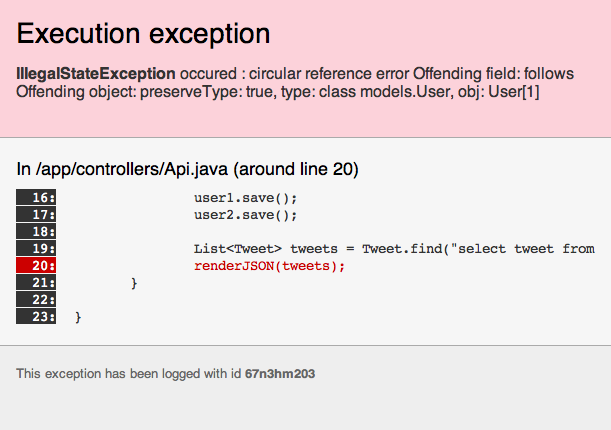
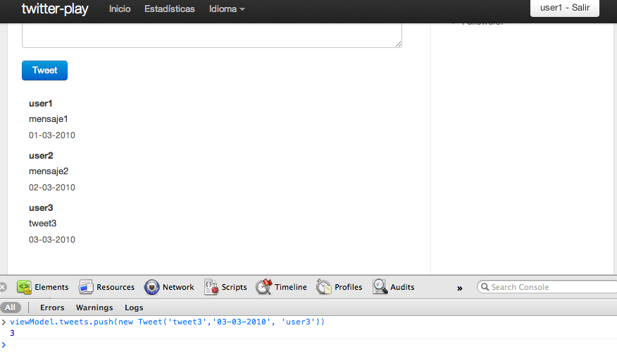

Vamos a mejorar nuestro Timeline añadiendo [AJAX](http://en.wikipedia.org/wiki/AJAX) para evitar la recarga completa de la página cuando se envía un nuevo tweet. El objetivo es enviar un tweet mediante AJAX y si todo va bien, consultar de nuevo el timeline y actualizarlo.

Vamos a crear una API para nuestra aplicación, que nos permita desde javascript hacer las consultas adecuadas. Como formato para las respuesta vamos a utilizar [JSON](http://en.wikipedia.org/wiki/JSON), por su facilidad para trabajar con él desde javascript.

## Creando el API

Vamos a crear un controlador nuevo que se va tener las acciones disponibles en nuestra API.

Empezamos con un método que nos permite ver todos los tweets que ha escrito un usuario

app/controllers/Api.java


package controllers;

import java.util.List;

import models.Tweet;
import models.User;
import play.mvc.Controller;

public class Api extends Controller {

	public static void tweetsAll(){
		List<Tweet> tweets = Tweet.find("order by date desc").fetch();
		renderJSON(tweets);
	}
	
}


Con el método renderJSON estamos transformando nuestra lista de tweets a formato JSON. Este método hace un recorrido en profundidad.

Añadimos la ruta al fichero de rutas

conf/routes

	GET     /api/tweets/all              Api.tweetsAll

Para probar que funciona correctamente entramos en [http://localhost:9000/api/tweets/all](http://localhost:9000/api/tweets/all).

Si nos fijamos en la respuesta, vemos que se muestran todos y cada uno de los campos. Se muestra por ejemplo el campo contraseña, algo no demasiado seguro y en la lista de usuarios que sigue alguien, se muestran todos los datos de ese usuario, incluso los usuarios a los que sigue.

## Problema de referencia circular

¿Qué pasa si el user1 sigue al user2 y el user2 sigue al user1?

Vamos a hacer una modificación rápida en el código para probarlo


package controllers;

import java.util.List;

import models.Tweet;
import models.User;
import play.mvc.Controller;

public class Api extends Controller {

	public static void tweetsAll(){
		User user1 = User.find("byUsername", "user1").first();
		User user2 = User.find("byUsername", "user2").first();
		user1.follows.add(user2);
		user2.follows.add(user1);
		user1.save();
		user2.save();
		
		List<Tweet> tweets = Tweet.find("order by date desc").fetch();
		renderJSON(tweets);
	}
	
}


Consultamos los tweets de user1

[http://localhost:9000/api/tweets/all](http://localhost:9000/api/tweets/all)

y

## Resolviendo el problema de referencia circulares

Para resolver nuestro problema lo que tenemos que hacer es seleccionar la información que vamos a devolver. Del autor vamos a devolver únicamente su username y no su contraseña ni la lista de personas a las que sigue.

Por defecto play utilizar la librería GSON para convertir a JSON. Esta librería permite escribir [Serializer personalizados](https://sites.google.com/site/gson/gson-user-guide#TOC-Custom-Serialization-and-Deserializ). El código queda un poco engorroso, así que vamos a utilizar otra librería que en mi opinión tiene una mejor interfaz, [flexjson](http://flexjson.sourceforge.net/).

Lo primero que debemos hacer es añadir la dependencias de la librería nueva


	# Application dependencies

	require:
	    - play
	    - play -> secure
	    - net.sf.flexjson -> flexjson 2.2-SNAPSHOT


Ejecutamos

	play dependencies
	play eclipsify
	
Con el comando de dependencias play se descargará automáticamente la librería del repositorio Central de Maven.

Actualiza el proyecto en Eclipse y reinicia el servidor.

Modifica el método para filtrar los campos que se devuelven


package controllers;

import java.util.List;

import flexjson.JSONSerializer;

import models.Tweet;
import models.User;
import play.mvc.Controller;

public class Api extends Controller {

	public static void tweetsAll(){
		List<Tweet> tweets = Tweet.find("order by date desc").fetch();
		renderJSON(new JSONSerializer().include("msg", "date", "author.username").exclude("*").serialize(tweets));
	}
	
}
	

Prueba de nuevo la consulta

[http://localhost:9000/api/tweetsFromUser/user1](http://localhost:9000/api/tweetsFromUser/user1)

## Añadiendo javascript a la vista

Para la vista vamos a utilizar [jQuery](http://jquery.com/) y [Knockout.js](http://knockoutjs.com/). 

* [jQuery](http://jquery.com/) es una de las librerías más utilizadas en la actualidad. La utilizaremos para manipular el DOM y para hacer peticiones AJAX
* [Knockout.js](http://knockoutjs.com/) implementa el patrón Model-View-View Model y permite tener sincronizada la interfaz del usuario de una forma muy sencilla

## Introducción a jQuery

## Introducción a Knockout.js

## Implementación

### Primer paso: Trabajar con dependentArray

Lo primero que vamos a hacer es sentar las bases con knockout.js y vamos a implementar de nuevo nuestro modelo.





En nuestro modelo tenemos los tweets, que son un observable array con dos Tweets de prueba.

Ahora necesitamos una plantilla para pintar esos tweets en la pantalla.





Utilizamos la misma estrategia que usamos anteriormente cuando creamos el tag. Pero esta vez estamos haciendo una plantilla para utilizar con jquery tmpl.

Para probar que todo funciona [http://localhost:9000/](http://localhost:9000/) y debería aparecer el mensaje1 y el mensaje2.

El objetivo del dependentArray es que cuando añadamos un tweet nuevo al array. La interfaz gráfica se actualice automáticamente. Para probarlo tenemos que abrir la consola javascript (En Chrome Menu/Herramientas/Consola Javascript).

Añadimos un nuevo tweet al array


viewModel.tweets.push(new Tweet('tweet3','03-03-2010', 'user3'))


## Segundo paso: Poblando el array mediante AJAX

Añadimos una nueva función que se va a encargar de hacer una petición y añadir los tweets de la respuesta.


viewModel.updateTweets = function(){
	$.get('@{Api.tweetsAll()}', function(data){
		var tweets = $.map(data, function(item){
			return new Tweet(item.msg, item.date, item.author.username)
		})
		viewModel.tweets(tweets);
	});
}


Añadimos una llamada a la función cuando la página se ha cargado


$(function(){
	viewModel.updateTweets();
});


## Tercer paso: Enviando tweets mediante AJAX

Añade un nuevo método a la API que permita enviar tweets y nos devuelva el tweet creado en caso de que todo fue bien.


public static void tweetsNew(String msg){
	Tweet t = new Tweet(msg, Security.userConnected());
	t.validateAndSave();
	ApiResponse resp = new ApiResponse();
	if(validation.hasErrors()){
		resp.status = "ERROR";
		resp.message = Utils.join(validation.errors(), ",");
	}else{
		resp.status = "OK";
		resp.result = t;
	}
	JSONSerializer serializer = new JSONSerializer().include("status", "message", "result.msg", "result.date", "result.author.username").exclude("*");
	renderJSON(serializer.serialize(resp));
}


Crea la clase ApiResponse que nos va a permitir encapsular las respuesta de nuestra API. Por si se producen error poder tener un lugar donde enviar los mensajes de error.


package responses;

public class ApiResponse {
	public String status;
	public String message;
	public Object result;
}


Añade la ruta

	GET     /api/tweets/new                              Api.tweetsNew
	
Modifica la vista

La función createTweet se encarga de hacer la petición a la acción tweetsNew pasándole por parámetro el mensaje del tweet nuevo. Si la respuesta fue correcta lo añade a la lista de tweets. Si hubo error lo almacena en el modelo para actualizar la interfaz.


function parseTweet(tweet){
	return new Tweet(tweet.msg, new Date(tweet.date), tweet.author.username);
}

viewModel.createTweet = function(){
	var action = #{jsAction @Api.tweetsNew(':msg')/}
	$.get(action({msg : viewModel.newTweet()}), function(data){
		if(data.status === 'OK'){
			viewModel.tweets.unshift(parseTweet(data.result));
			viewModel.newTweet('');
			viewModel.clearError();
		}else{
			viewModel.error(data.message);
		}
	});
	return false;
}


Cambiamos nuestro formulario, para que al hacer submit, se ejecute la función createTweet.


<form data-bind="submit:createTweet">
	

		<textarea class="xxlarge" name="tweet" rows="3" data-bind="value:newTweet"></textarea>
	

	<input type="submit" class="btn primary" value="Tweet">
</form>


Ponemos el código para mostrar los errores



	<a class="close" href="#" data-bind="click: clearError">×</a>
	



Añadimos una función para limpiar los errores. Esta función se ejecutará cuando en tweet se envíe correctamente o cuando el usuario pulse la 'x' del mensaje.


viewModel.clearError = function(){
	viewModel.error(null);
	return false;
}


La aspecto final de la vista es


#{extends 'main.html' /} 
#{set title:'Timeline' /} 

#{set 'secondaryContent'}
<ul>
	<li>Following: </li>
	<li>Followers: </li>
</ul>
#{/set}

	<a class="close" href="#" data-bind="click: clearError">×</a>
	

<form data-bind="submit:createTweet">
	

		<textarea class="xxlarge" name="tweet" rows="3" data-bind="value:newTweet"></textarea>
	

	<input type="submit" class="btn primary" value="Tweet">
</form>



Puedes descargar el código desde desde <a href="https://github.com/axelhzf/play-curso/commit/4a9bc29137016576141c1237410f066d3d9728d4">https://github.com/axelhzf/play-curso/commit/4a9bc29137016576141c1237410f066d3d9728d4</a>

## Ejercicio

Hasta ahora nuestra aplicación no es más que una especie de tablón de anuncios donde los usuarios pueden escribir sus mensajes. Vamos a dotarle de las funcionalidades de twitter.

* Mostrar información de follows y followers
* Consultar los tweets que ha enviado un usuario en concreto
* Limitar los tweets que aparecen en el timeline a los de personas a las que sigue el usuario y los propios
* Mostrar botones de follow y unfollow
* Hacerlo implementando los métodos en el API y haciendo las llamadas mediante javascript

## Solución

Para mostrar la información de el número de personas que sigue y que son seguidas por un usuario vamos a modificar la entidad User y añadir un nuevo método en nuestra API.

app/models/User.java


@Entity
public class User extends Model {
	...
	
	@Transient
	public Long followsNumber;
	
	@Transient
	public Long followersNumber;

	/**
	 * Cuenta el número de persona que sigue un usuario
	 * @return
	 */
	public Long getFollowsNumber(){
		if(followsNumber == null){
			followsNumber = User.count("select count(follow) from User user join user.follows follow where user = ?", this);
		}
		return followsNumber;		
	}
	
	/**
	 * Cuenta el número de persona que siguen a un usuario
	 * @return
	 */
	public Long getFollowersNumber(){
		if(followersNumber == null){
			followersNumber = User.count("select count(user) from User user where ? member of user.follows", this);
		}
		return followersNumber;
	}	
}	


La anotación @Transient permite que un campo no se almacene en base de datos. Sirve para indicar campos calculados.

app/controller/Api.java


public class Api extends Controller {
	...
	
	public static void userInfo(String username){
		User user = User.find("byUsername", username).first();
		ApiResponse resp = new ApiResponse();
		if(user!= null){
			resp.status = "OK";
			resp.result = user;
		}else{
			resp.status = "ERROR";
			resp.message = "User not found";
		}
		renderJSON(new JSONSerializer().include("status", "message", "result.username", "result.followsNumber", "result.followersNumber").exclude("*").serialize(resp));
	}
}



app/conf/routes


GET     /api/user/{username}						 Api.userInfo


Pruebas

[http://localhost:9000/api/user/user1](http://localhost:9000/api/user/user1)

	{"message":null,"result":{"followersNumber":3,"followsNumber":0,"username":"user1"},"status":"OK"}

[http://localhost:9000/api/user/user3](http://localhost:9000/api/user/user3)

	{"message":null,"result":{"followersNumber":1,"followsNumber":2,"username":"user3"},"status":"OK"}

[http://localhost:9000/api/user/user10](http://localhost:9000/api/user/user10)

	{"message":"User not found","result":null,"status":"ERROR"}
	
	
apps/views/Timeline/index.html


#{set 'secondaryContent'}

	<h3 data-bind="text: userInfo().username"></h3>
	<ul>
		<li>Following: </li>
		<li>Followers: </li>
	</ul>

#{/set}

....

....

#{set 'endScript'}
<script>

var UserInfo = function(username, following, followers){
	this.username = username;
	this.following = following;
	this.followers = followers;
}

var viewModel = {
	newTweet : ko.observable(''),
	error : ko.observable(null),
	tweets : ko.observableArray([]),
	connectedUser : '${controllers.Security.userConnected().username}',
	username : ko.observable(''),
	userInfo : ko.observable(new UserInfo("", 0, 0))
}

ko.linkObservableToUrl(viewModel.username, "user", '${controllers.Security.userConnected().username}');

viewModel.username.subscribe(function(username) {
	var action = #{jsAction @Api.userInfo(':username')/};
	$.get(action({username : username}), function(data){
		if(data.status === 'OK'){
			viewModel.userInfo(new UserInfo(data.result.username, data.result.followsNumber, data.result.followersNumber));
		}else{
			viewModel.error(data.message);
		}
	});	
});
#{/set}



Vamos a añadir nuevos métodos que muestran el Timeline de un usuario y los tweets de un usuario en concerto.

apps/controllers/Api.java


public static void timeline(){
    List<Object> tweets = Tweet.find("select tweet from Tweet tweet, User user where user = ? and (tweet.author = user or tweet.author member of user.follows) order by tweet.date desc", Security.userConnected()).fetch();
    ApiResponse resp = new ApiResponse();
    resp.status = "OK";
    resp.result = tweets;
	renderJSON(tweetsSerializer.serialize(resp));
}

public static void tweetsFromUser(String username){		
	List<Tweet> tweets = Tweet.find("select tweet from Tweet tweet where tweet.author.username = ? order by tweet.date desc", username).fetch();
    ApiResponse resp = new ApiResponse();
    resp.status = "OK";
    resp.result = tweets;
	renderJSON(tweetsSerializer.serialize(resp));
}


apps/views/Timeline/index.html


viewModel.username.subscribe(function(user) {
	var viewTimeline = false;
	var username = user;
	
	if(typeof username == 'undefined' || username === ''){
		var viewTimeline = true;
		var username = '${controllers.Security.userConnected().username}';			
	}
	
	var action = #{jsAction @Api.userInfo(':username')/};
	
	//Información del usuario
	$.get(action({username : username}), function(data){
		if(data.status === 'OK'){
			viewModel.userInfo(new UserInfo(data.result.username, data.result.followsNumber, data.result.followersNumber));
		}else{
			viewModel.error(data.message);
		}
	});
	
	//Timeline o tweets de un usuario concreto
	var url;
	if(viewTimeline){
		//Timeline
		url = '@{Api.timeline}';
		console.log('url timeline' + url);
	}else{
		//Tweets de un usuario
		var action = #{jsAction @Api.tweetsFromUser(':username')/};
		url = action({username : username});
	}
	
	//Recupera los tweets
	$.get(url, function(data){	
		if(data.status === 'OK'){
			var tweets = $.map(data.result, function(item){
				return parseTweet(item);
			})
			viewModel.tweets(tweets);
		}else{
			viewModel.error(data.message);
		}
	});	
});


Por último vamos a añadir los botones de follow y unfollow.


public static void follow(String user){
    User usuarioConectado = Security.userConnected();
    User usuarioConsultado = User.find("byUsername", user).first();
    
    usuarioConectado.follows.add(usuarioConsultado);
    usuarioConectado.save();
    
    ApiResponse resp = new ApiResponse();
    resp.status = "OK";
    renderJSON(statusSerializer.serialize(resp));
}

public static void unfollow(String user){
    User usuarioConectado = Security.userConnected();
    User usuarioConsultado = User.find("byUsername", user).first();
    
    usuarioConectado.follows.remove(usuarioConsultado);
    usuarioConectado.save();
    
    ApiResponse resp = new ApiResponse();
    resp.status = "OK";
    renderJSON(statusSerializer.serialize(resp));
}

public static void isFollowing(String user){
	User usuarioConectado = Security.userConnected();
    User usuarioConsultado = User.find("byUsername", user).first();
    
    ApiResponse resp = new ApiResponse();
    resp.status = "OK";
    resp.result = usuarioConectado.follows.contains(usuarioConsultado);
    renderJSON(statusSerializer.serialize(resp));
}




	

		<a href="#" class="btn" data-bind="click: followUser">Follow</a>
	

	
	

		<a href="#" class="btn" data-bind="click: unfollowUser">Unfollow</a>
	




viewModel.username.subscribe(refresh);

function refresh(user){
	var username;
	var connectedUser;
	if(typeof user == 'undefined' || user === ''){
		viewModel.viewTimeline(true);
		username = '${controllers.Security.userConnected().username}';			
	}else{
		viewModel.viewTimeline(false);
		username = user;
	}
	
	var action = #{jsAction @Api.userInfo(':username')/};
	
	//Información del usuario
	$.get(action({username : username}), function(data){
		if(data.status === 'OK'){
			viewModel.userInfo(new UserInfo(data.result.username, data.result.followsNumber, data.result.followersNumber));
		}else{
			viewModel.error(data.message);
		}
	});
	
	//Timeline o tweets de un usuario concreto
	var url;
	if(viewModel.viewTimeline()){
		//Timeline
		url = '@{Api.timeline}';
	}else{
		//Tweets de un usuario
		var action = #{jsAction @Api.tweetsFromUser(':username')/};
		url = action({username : username});
	}
	
	//Recupera los tweets
	$.get(url, function(data){	
		if(data.status === 'OK'){
			var tweets = $.map(data.result, function(item){
				return parseTweet(item);
			})
			viewModel.tweets(tweets);
		}else{
			viewModel.error(data.message);
		}
	});
	
	//Información de si está siguiendo o no al usuario
	if(!viewModel.viewTimeline()){
		var action = #{jsAction @Api.isFollowing(':username')/};
		var url = action({username : username});
		$.get(url, function(data){
			if(data.status === 'OK'){
				viewModel.connectedFollowingUsername(data.result);
			}else{
				viewModel.error(data.message);
			}
		});
	}	
}

viewModel.followUser = function(){
	var action = #{jsAction @Api.follow(':username')/};
 	var url = action({username : viewModel.username()});
 	$.get(url, function(data){
 		if(data.status === 'OK'){
 			refresh(viewModel.username());
 		}
 	}); 
}

viewModel.unfollowUser = function(){
	var action = #{jsAction @Api.unfollow(':username')/};
 	var url = action({username : viewModel.username()});
 	$.get(url, function(data){
 		if(data.status === 'OK'){
 			refresh(viewModel.username());
 		}
 	}); 
}


Puedes descargar la solución desde <a href="https://github.com/axelhzf/play-curso/commit/9645a201a95a95f8ab628a8e4f10fa90077b9f25">https://github.com/axelhzf/play-curso/commit/9645a201a95a95f8ab628a8e4f10fa90077b9f25</a>

