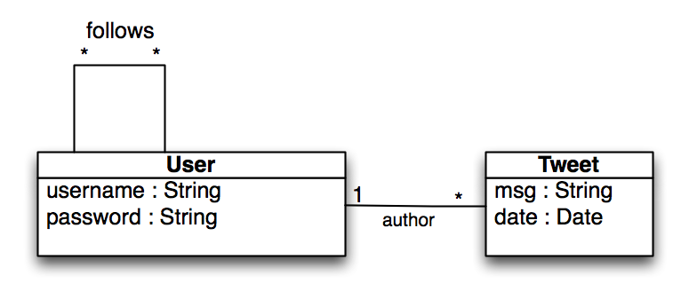

Una representación del módelo de nuestro twitter simple podría ser la siguiente.

* Entidad **User**, con **username** y **password**.
* Entidad **Tweet**, con el contenido del tweet **msg** y la fecha de publicación **date**.
* Todos los **Tweet**s tienen un **autor** de tipo **User**. Un mismo **Usuario** puede ser **autor**de múltiples *Tweet*s.
* Un **Usuario** puede **seguir** a muchos **Usuarios** y un **Usuario** puede ser seguido por muchos **Usuarios**.

Traduciendo el diagrama a código quedaría:

app/models/User.java


package models;

import java.util.ArrayList;
import java.util.List;
import javax.persistence.Entity;
import javax.persistence.ManyToMany;
import play.db.jpa.Model;

@Entity
public class User extends Model {

    public String username;

    public String password;

    @ManyToMany
    public List<User> follows;

    public User(String username, String password) {
        super();
        this.username = username;
        this.password = password;
        follows = new ArrayList<User>();
    }
}


app/models/Tweet.java


package models;

import java.util.Date;
import javax.persistence.Entity;
import javax.persistence.ManyToOne;
import play.db.jpa.Model;

@Entity
public class Tweet extends Model {

    public String msg;

    @ManyToOne
    public User author;

    public Date date;

    public Tweet(String msg, User author){
        this.msg = msg;
        this.author = author;
        date = new Date();
    }

}
	

## Enteniendo la creación del módelo

### @Entity, @ManyToOne, @ManyToMone

Play utiliza Hibernate. Hibernate es una herramienta de Mapeo objeto-relacional (ORM) que facilita el mapeo de atributos entre una base de datos relacional tradicional y el modelo de objetos de una aplicación, mediante archivos declarativos (XML) o anotaciones en los beans 
de las entidades que permiten establecer estas relaciones.

Hibernate es una implementación del standard JPA. Java Persistence API, es la API de persistencia desarrollada para la plataforma Java EE e La Java Persistence API, a veces referida como JPA, es un framework del lenguaje de programación Java que maneja datos relacionales en aplicaciones usando la Plataforma Java en sus ediciones Standard (Java SE) y Enterprise (Java EE).

Además Hibernate añade algunas anotaciones propias que no están dentro del standard. Es conveniente utilizar las anotaciones del standard siempre que sea posible.

[Documentación de Hibernate 3.6](http://docs.jboss.org/hibernate/core/3.6/quickstart/en-US/html/)

Haciendo un resumen rápido de las anotaciones más utilizadas:

* **@Entity** - Marca una clase como entidad (Tendrá un mapeo en base de datos)
* **Relaciones**
   * **@OneToOne** -
   * **@OneToMany** -
   * **@ManyToMany** -
   * **@ManyToMany** -
* **@Column** - Permite especificar atributos de las columnas de la tabla.

También JPA cuenta con su propio lenguaje de consultas JPQL, que es similar a SQL. La principale ventaja que tiene JPQL es que trabaja con nombre de entidades y de atributos y no con el esquema de base de datos directamente. Además permite navegar mediante las relaciones sin necesidad de hacer incomodos JOIN.

[http://en.wikipedia.org/wiki/Java_Persistence_Query_Language](http://en.wikipedia.org/wiki/Java_Persistence_Query_Language)

JPA/Hibernate es muy amplio y en este curso solo veremos lo que nos vaya haciendo falta. Nos vamos a centrar más en estudiar la capa de ayuda que pone Play trabajar con los modelos.

### extends play.db.jpa.Model

Si tu entidad extiende de la clase play.db.jpa.Model contará con varios métodos que te permitiran hacer el CRUD (Create, Read, Update, Delete) de la entidad. Sin más complicaciones. Sin tener que escribir ni una linea de código más.
Nos olvidamos de toda la capa de DAOs que es un patrón común en las aplicaciones Java EE.

Además le añadirá un campo "id" de tipo Long a tu entidad, que será la clave primaria de la tabla. Es una buena práctica por cuestiones de rendimiento que la clave primaria sea de tipo Long, a pesar de que conceptualmente pueda haber otro tipo de clave. Esta otra clave se puede definir como un campo unique, para conservar la restricción.

#### Métodos que aporta extender de play.db.jpa.Model


//Recuperando objetos
Post post = Post.findById(5L);  
List<Post> posts = Post.findAll();
List<Post> posts = Post.all().fetch();
List<Post> posts = Post.all().fetch(100); //limit 100
List<Post> posts = Post.all().from(50).fetch(100);

//Búsqueda usando querys simplicados
Post.find("byTitle", "My first post").fetch();
Post.find("byTitleLike", "%hello%").fetch();
Post.find("byAuthorIsNull").fetch();
Post.find("byTitleLikeAndAuthor", "%hello%", connectedUser).fetch();

//Busquedas utilizando JPQL
Post.find(
    "select p from Post p, Comment c " +
    "where c.post = p and c.subject like ?", "%hop%"
);

//Contar objetos
long postCount = Post.count();
long userPostCount = Post.count("author = ?", connectedUser);	

//Crear o editar
post.save();


## Manejo de transacciones

Play maneja automáticamente las transacciones. Por cada HTTP request crea una nueva petición y realiza el commit cuando envia el HTTP response. En el caso de que el código lance una excepción, la transacción hace rollback automáticamente.

Para forzar un rollback se puede utilizar


JPA.setRollbackOnly()


Si marcamos la transacción como sólo de lectura, mejoraremos el rendimiento del acceso a base de datos. Anotaremos el método de nuestro controlador con:


@play.db.jpa.Transactional(readOnly=true)

	
Si un método de un controlador o un controlador entero no va a hacer uso de base de datos se le puede indicar a Play que no cree una transacción con el HTTP Request:


@play.db.jpa.NoTransaction	


## Configuración de la base de datos

Por ahora no hemos definido qué tipo de base de datos vamos a utilizar. Para ellos editamos el fichero **conf/application.conf** y busca las lineas

	# To quickly set up a development database, use either:
	#   - mem : for a transient in memory database (H2 in memory)
	#   - fs  : for a simple file written database (H2 file stored)
	# db=mem
	#
	# To connect to a local MySQL5 database, use:
	# db=mysql:user:pwd@database_name	

Es necesario descomentar la linea (quitar el #) para decirle a play que nuestra aplicación va a utilizar base de datos.

Tenemos tres opciones:

* mem - Para crear una base de datos en memoria. Cada vez que reiniciemos la aplicación se borraran los datos que tengamos almacenados.
* fs - Para crear una base de datos en fichero.
* mysql - Para utilizar una base de datos MySQL.

En este mismo fichero, casi al final, está la linea

	%test.db.url=jdbc:h2:mem:play;MODE=MYSQL;LOCK_MODE=0
	
Que especifica que cuando play arranca en modo test (play test). Utilizará una base de datos en memoria.	

Play trae integrado un administrador de base de datos vía web en  [http://localhost:9000/@db](http://localhost:9000/@db)

En el caso de que estemos trabajando con una base de datos MySQL en Windows, recomiendo utilizar [HeidiSQL](http://www.heidisql.com/).

## Poblando la base de datos para los test

Play incluye la clase Fixtures que permite cargar datos en la base de datos desde un fichero .yml.

Por ejemplo (initial-data.yml)


User(user1):
   username: user1
   password: user1

Tweet(t1u1):
    msg: "Tweet 1 de user1"
    author : user1
    date: 2011-01-01


## Ejercicio: Trabajando con el modelo

Partiendo del modelo de datos definido anteriormente. El objetivo de este ejercicio es familiarizarse con el uso de las entidades:

* Crear un test (test1) que añada varios usuarios a la base de datos y que posteriormente comprueba que están todos añadidos y que busque un usuario por su id, y que compruebe que los datos son correctos.
* Crear un test (test2) que añada varios tweets a la base de datos y que posteriormente compruebe que están todos añadidos a la base de datos. No te olvides de añadir la relación con el autor. Realiza también una consulta buscando un tweet por su id.
* Crear un test (test3) que cree varios tweets de varios autores y que luego haga una consulta contando los tweets de un usuario en concreto.
* Crear un test (test4) que añada varios tweets con diferentes fechas. Luego haga una consulta contando los tweets que son anteriores a una fecha concreta.
* Crear un test (test5) que cree varios usuarios y que se sigan entre si. Contar cuantos usuarios sigue a uno en concreto.
* Crear un test (test6) que cree varios usuarios y que se sigan entre si. Contar cuantos usuarios siguen a uno en concreto.
* Crear un test (test7) que utilizando la clase Fixtures, pueble la base de datos a partir de un fichero .yml y que realice alguna comprobación, para asegurarnos que se ha leído desde fichero correctamente.
* Crea un test (test8) que cree un usuario en base de datos. Modifique algunos datos y haga un Rollback. Consulta la base de datos para comprobar que los datos del usuario están en el estado original.

## Consejos

* Busca información de la anotación @Before de JUnit
* Consulta la documentación de la clase [Fixtures](http://www.playframework.org/documentation/api/1.2.3/play/test/Fixtures.html)
* No olvides extender de la clase UnitTest
* No olvides anotar tus métodos con @Test
* Puedes utilizar [este fichero para poblar la base de datos](resources/initial-data.yml)

## Solución

Puedes ver y descargarte el código del ejercicio desde <a href="https://github.com/axelhzf/play-curso/tree/47d94bec3d04476cce572088bf89dad4342f03e3">https://github.com/axelhzf/play-curso/tree/47d94bec3d04476cce572088bf89dad4342f03e3</a>


import java.text.ParseException;
import java.text.SimpleDateFormat;
import java.util.Date;
import java.util.List;

import javax.persistence.EntityTransaction;

import org.junit.Before;
import org.junit.Test;

import junit.framework.Assert;
import models.Tweet;
import models.User;
import play.db.jpa.GenericModel.JPAQuery;
import play.db.jpa.JPA;
import play.db.jpa.JPABase;
import play.test.Fixtures;
import play.test.UnitTest;

public class ModelTest extends UnitTest {

	@Before
	public void setup(){
		Fixtures.deleteDatabase();
	}

	@Test
	public void test1(){
		User u1 = new User("user1", "password1");
		u1.save();
		User u2 = new User("user2", "password2");
		u2.save();
		User u3 = new User("user3", "password3");
		u3.save();

		long count = User.count();
		Assert.assertEquals(3, count);

		User u1Found = User.findById(u1.id);
		Assert.assertNotNull(u1Found);
		Assert.assertEquals("user1", u1Found.username);
		Assert.assertEquals("password1", u1Found.password);
	}

	@Test
	public void test2(){
		User u1 = new User("user1", "password1");
		u1.save();

		Tweet t1 = new Tweet("msg1", u1);
		t1.save();

		Tweet t2 = new Tweet("msg2", u1);
		t2.save();

		Tweet t3 = new Tweet("msg3", u1);
		t3.save();

		long count = Tweet.count();
		Assert.assertEquals(3, count);

		Tweet t1Found = Tweet.findById(t1.id);
		Assert.assertNotNull(t1Found);
		Assert.assertEquals("msg1", t1Found.msg);
		Assert.assertEquals("user1", t1Found.author.username);
	}

	@Test
	public void test3(){
		User u1 = new User("user1", "password1");
		u1.save();

		User u2 = new User("user2", "password2");
		u2.save();

		Tweet t1 = new Tweet("msg1", u1);
		t1.save();

		Tweet t2 = new Tweet("msg2", u1);
		t2.save();

		Tweet t3 = new Tweet("msg3", u2);
		t3.save();

		long count = Tweet.count();
		Assert.assertEquals(3, count);

		List<Tweet> founds = Tweet.find("byAuthor", u1).fetch();
		Assert.assertNotNull(founds);
		Assert.assertEquals(2, founds.size());
		Assert.assertTrue(founds.contains(t1));
		Assert.assertTrue(founds.contains(t2));
		Assert.assertFalse(founds.contains(t3));
	}

	@Test
	public void test4() throws ParseException{
	    SimpleDateFormat formatter = new SimpleDateFormat("dd/MM/yyyy");

		Tweet t1 = new Tweet("tweet1", null);
		t1.date = formatter.parse("01/01/2000");
		t1.save();
		Tweet t2 = new Tweet("tweet2", null);
		t2.date = formatter.parse("01/02/2000");
		t2.save();
		Tweet t3 = new Tweet("tweet3", null);
		t3.date = formatter.parse("02/01/2010");
		t3.save();

		List<Tweet> founds = Tweet.find("byDateGreaterThan", formatter.parse("01/01/2010")).fetch();
		Assert.assertNotNull(founds);
		Assert.assertEquals(1, founds.size());
		Assert.assertTrue(founds.contains(t3));
		Assert.assertFalse(founds.contains(t1));
		Assert.assertFalse(founds.contains(t2));
	}

	@Test
	public void test5(){
		User u1 = new User("usur1", "password1");
		u1.save();

		User u2 = new User("user2", "password2");
		u2.save();

		User u3 = new User("user3", "password3");
		u3.save();

		User u4 = new User("user4", "password4");
		u4.follows.add(u1);
		u4.follows.add(u2);
		u4.follows.add(u3);
		u4.save();

		User uFound = User.findById(u4.id);
		Assert.assertNotNull(uFound);
		Assert.assertEquals(3, uFound.follows.size());
		Assert.assertTrue(uFound.follows.contains(u1));
		Assert.assertTrue(uFound.follows.contains(u2));
		Assert.assertTrue(uFound.follows.contains(u3));
	}

	@Test
	public void test6(){
		User u1 = new User("usur1", "password1");
		u1.save();

		User u2 = new User("user2", "password2");
		u2.follows.add(u1);
		u2.save();

		User u3 = new User("user3", "password3");
		u3.follows.add(u1);
		u3.save();

		User u4 = new User("user4", "password4");
		u4.follows.add(u1);
		u4.save();

		List<User> founds = User.find("select user from User user where ? member of user.follows",u1).fetch();
		Assert.assertNotNull(founds);
		Assert.assertEquals(3, founds.size());
		Assert.assertTrue(founds.contains(u2));
		Assert.assertTrue(founds.contains(u3));
		Assert.assertTrue(founds.contains(u4));
	}

	@Test
	public void test7(){
		Fixtures.loadModels("initial-data.yml");
		long usersCount = User.count();
		Assert.assertEquals(4, usersCount);
		long tweetsCount = Tweet.count();
		Assert.assertEquals(9, tweetsCount);
	}

	@Test
	public void test8(){
		EntityTransaction tx = JPA.em().getTransaction();

		User u1 = new User("user1", null);
		u1.save();
		tx.commit();

		tx.begin();
		User userFound = User.findById(u1.id);
		Assert.assertNotNull(userFound);
		Assert.assertEquals("user1", userFound.username);

		userFound.username = "not user1";
		userFound.save();
		tx.rollback();

		tx.begin();
		User userFound2 = User.findById(u1.id);
		Assert.assertNotNull(userFound2);
		Assert.assertEquals("user1", userFound2.username);		
	}
}
