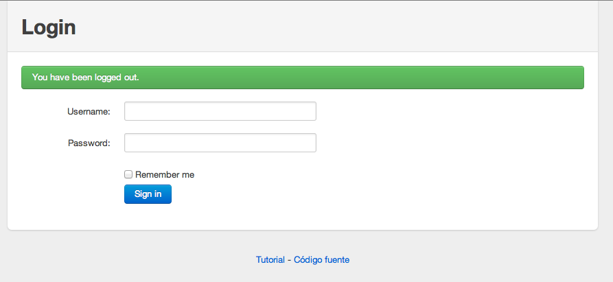



El módulo Secure es uno de los módulos que vienen por defecto con la distribución de Play. Permite añadir login mediante usuario y contraseña a nuestra aplicación.

## Instalación

Añadimos las dependencias del módulo de seguridad

conf/dependencies.yml


# Application dependencies

require:
    - play
    - play -> secure


Ejecutamos en la terminal

	play dependencies
	play eclipsify
	

Estos dos comandos los debemos ejecutar cada vez que modifiquemos nuestro fichero de dependencias. El primer comando se descarga en el proyecto las dependencias necesarias y el segundo actualiza la configuración del proyecto de Eclipse, para que tenga en cuenta las dependencias nuevas. Actualiza el proyecto de Eclipse pulsando F5 con el proyecto seleccionado.

Añade las rutas por defecto
conf/routes

	*      /                module:secure

Importante Cada vez que añadas una nueva librerías deberás reiniciar el servidor

##  Uso

Anota el controlador al que quieras ponerle restricción de seguridad con la anotación @With(Secure.class)


package controllers;
...

@With(Secure.class)
public class Timeline extends Controller {
 ...
}


Ahora cuando accedes a [http://localhost:9000/](http://localhost:9000/) nos redireccionará a la página de login [http://localhost:9000/login](http://localhost:9000/login)

## Personalizando la autenticación

Para personalizar el mecanismo de autenticación debemos crear una clase que extienda de Secure.Security y sobreescribir el método authenticate


package controllers;
import models.User;

public class Security extends Secure.Security {
    static boolean authenticate(String username, String password) {
        User user = User.find("byUsername", username).first();
        return user != null && user.password.equals(password);
    }

    static User userConnected(){
        User user = User.find("byUsername", session.get("username")).first();
        return user;
    }   
}


Prueba a hacer login con algunos de los usuarios definido en [initial-data.yml](resources/initial-data.yml)

## Usuario conectado y logout

Vamos a modificar la plantilla para mostrar el usuario que está conectado y ponerle un botón que le permita desconectarse de la aplicación.

app/views/main.hml


<form action="@{Secure.logout}" class="pull-right">
   <button class="btn" type="submit">${controllers.Security.userConnected().username} - Salir</button>
</form>


## Personalizando la página de login

Para personalizar la página de login lo único que tenemos que hacer es crear una nueva vista que esté en la misma ruta que la vista del módulo.
Si nos fijamos en el proyecto de Eclipse tenemos un enlace al proyecto secure (aparece una carpeta de código con una flecha). En el proyecto tenemos la vista views.Secure.login.html que es la que muestra la pantalla de login. Lo que devemos hacer es crear una vista, dentro de nuestro proyecto, que esté en la misma ruta.

Basándonos en la vista original y aplicandole algunos estilos de twitter bootstrap tenemos esto

app/views/Secure/login.html


<!DOCTYPE html>
<html>
    <head>
        <title>Login</title>
        <meta charset="utf-8">
        <link rel="shortcut icon" type="image/png" href="@{'/public/images/favicon.png'}">
        
        <link rel="stylesheet" href="http://twitter.github.com/bootstrap/1.3.0/bootstrap.min.css">
        <link rel="stylesheet" media="screen" href="@{'/public/stylesheets/main.css'}">
    </head>
    <body style="padding: 0">
    
	

		

			

				<h1>Login</h1>
			

			

				#{form @authenticate()}
					
					#{if flash.error}
						

							&{flash.error}
						

					#{/if}
					#{if flash.success}
						

							&{flash.success}
						

					#{/if}
				
				
				

            		<label for="username">&{'secure.username'}</label>
            		

              			<input class="xlarge" id="username" name="username" size="30" type="text" value="${flash.username}" />
            		

          		

          		
          		

            		<label for="password">&{'secure.password'}</label>
            		

              			<input class="xlarge" id="password" name="password" size="30" type="password" value="" />
            		

          		

				

					<ul class="inputs-list">
						<li><label>
							<input type="checkbox" name="optionsCheckboxes" value="true" ${flash.remember ? 'checked="true"' : ''}>
							&{'secure.remember'}
						</label></li>
					</ul>
				

									
				

            		<input type="submit" class="btn primary" value="&{'secure.signin'}">
          		
	
				#{/form}
			

		

		<footer>
			

				<a href="http://axelhzf.github.com/play-curso/">Tutorial</a> - <a
					href="https://github.com/axelhzf/play-curso">Código fuente</a>
			

		</footer>

	

	<!-- /container -->

</body>
</html>


## Ejercicios: Añadir comprobación adicional

Vamos a establecer algunos usuarios administrador, que tendrán más privilegios que otros. Por ejemplo, los usuarios administradores serán los únicos capaces de ver la página de las estadísticas.

* Modifica el modelo añadiendo a los usuario un atributo booleano que indique si es administrador o no.
* Busca en la documentación del módulo de seguridad [http://www.playframework.org/documentation/1.2.3/secure](http://www.playframework.org/documentation/1.2.3/secure) cómo añadir comprobaciones adicionales con la anotacion @Check. En la sección "Adding authorization check
". La página de estadísticas sólo la podrán ver los administradores.
* Modifica el fichero initial-data.yml para poner al user1 y al user2 como administradores.
* Comprueba que tienes acceso con los usuarios adecuados y no con los demás.
* Modifica la plantilla que a los usuarios que no son administradores no les aparezca el enlace en el menú a la página de las estadísticas.

Consejos:

* Puede que en la documentación no esté, pero existe un tag para hacer las comprobaciones que hace check. Búscalo en el código fuente.



## Solución

Modifica la entidad User


package models;

import java.util.ArrayList;
import java.util.List;
import javax.persistence.Entity;
import javax.persistence.ManyToMany;
import play.db.jpa.Model;

@Entity
public class User extends Model {

	public String username;

	public String password;

	public boolean admin;
	
	@ManyToMany
	public List<User> follows;

	public User(String username, String password) {
		super();
		this.username = username;
		this.password = password;
		this.admin = false;
		follows = new ArrayList<User>();
	}
}


Añade la anotación @Check en el método que renderiza la página de las estadísticas


@Check("isAdmin")
public static void stats(){


Implementa la comprobación "isAdmin"


static boolean check(String profile) {
    User user = userConnected();
    if ("isAdmin".equals(profile)) {
        return user.admin;
    } else {
        return false;
    }
}


Modifica la plantilla para ocultar el enlace a la página de estadísticas si el usuario no es administrador.


	#{secure.check 'isAdmin'}
		<li><a href="@{Timeline.stats}">Estadísticas</a></li>
	#{/secure.check}


Puedes descargarte la solución completa desde <a href="https://github.com/axelhzf/play-curso/tree/60d3d27f62c041bf82d27879e5639af3b8ffc476">https://github.com/axelhzf/play-curso/tree/60d3d27f62c041bf82d27879e5639af3b8ffc476</a>

