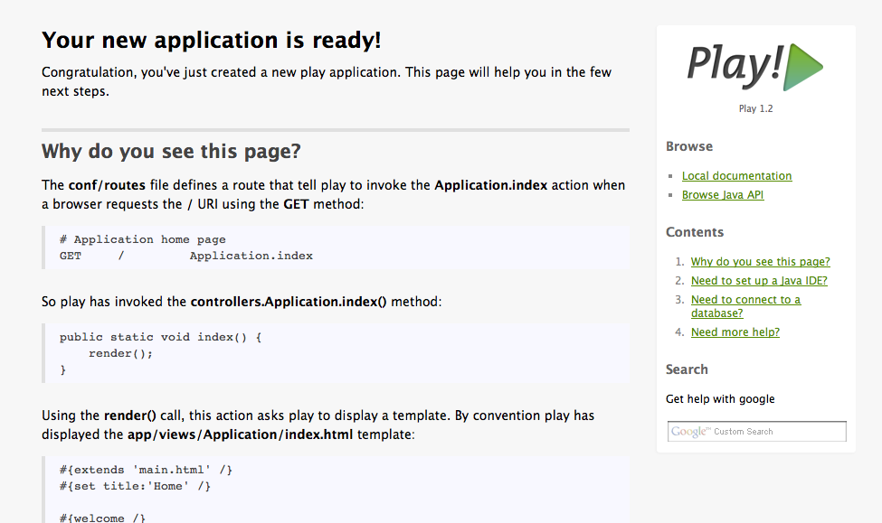

## Creación de un nuevo proyecto

Para crear el nuevo proyecto


> play new twitter

~        _            _ 
~  _ __ | | __ _ _  _| |
~ | '_ \| |/ _' | || |_|
~ |  __/|_|\____|\__ (_)
~ |_|            |__/   
~
~ play! 1.2.2, http://www.playframework.org
~
~ The new application will be created in /Volumes/Datos/Desarrollo/proyectos/play/play-curso/gh-pages/twitter
~ What is the application name? [twitter]

[ENTER]


Para arrancar el servidor de aplicaciones con la nueva aplicación creada


> cd twitter
> play run


Entramos en [http://localhost:9000/](http://localhost:9000/) y ya podemos acceder a la nueva aplicación creada.

El puerto <strong>9000</strong> es el puerto por defecto. 
Se puede cambiar en el fichero de configuración modificando el valor de <strong>http.port</strong>

## Estructura del proyecto creado


.
├── app
│   ├── controllers
│   │   └── Application.java
│   ├── models
│   └── views
│       ├── Application
│       │   └── index.html
│       ├── errors
│       │   ├── 404.html
│       │   └── 500.html
│       └── main.html
├── conf
│   ├── application.conf
│   ├── dependencies.yml
│   ├── messages
│   └── routes
├── lib
├── public
│   ├── images
│   │   └── favicon.png
│   ├── javascripts
│   │   └── jquery-1.5.2.min.js
│   └── stylesheets
│       └── main.css
└── test
    ├── Application.test.html
    ├── ApplicationTest.java
    ├── BasicTest.java
    └── data.yml
  

# Configuración en Eclipse

Play viene preparado para integrarse con varios IDEs [http://www.playframework.org/documentation/1.2.3/ide](http://www.playframework.org/documentation/1.2.3/ide) 

En el curso vamos a utilizar Eclipse.
Comando para generar los archivos de configuración de Eclipse


play eclipsify


Para importar el proyecto desde Eclipse

	File/Import/General/Existing project

¿Cómo Depurar?

eclipse/twitter.launch  -> Botón derecho/Run As/Twitter

eclipse/Connect JPDA to twitter.launch -> Botón derecho/Debug As/Connect JPDA to twitter	

Pruébalo colocando un breakpoint y revisa en la pestaña debug de Eclipse.